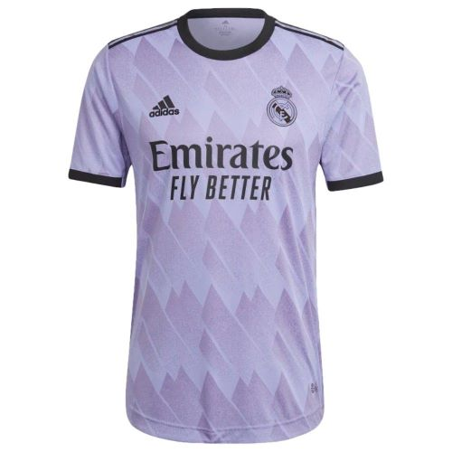

# **REAL MADRID LANDING PAGE**

# INTRODUCTION

Real Madrid F.C. is one of the most successful clubs in football history. This site was created for anyone wanting to know more about the club's recent history, and was designed with the aim that a user feels like they are accessing a fan club extension of the official website. The site focuses on the recent trophies, all time goalscorers and squad, while at the same time providing the user with the ability to visit the official site and their social platforms to maximise the feeling that this site is an extension of the official site.

I hope you enjoy your experience on the site and find it reflects the passion and feelings that Madridistas feel when supporting our team.

Find out our most recent trophy hauls, check out the Bernabeu's renovations on the main page and meet the squad by accessing the site - [Real Madrid](https://j95ortiz.github.io/Real-Madrid-Portfolio-project-1/index.html)

# USER EXPERIENCE

## Overview

The user's experience and feel was the priority of the design, with the main aim being that they are able to identify exactly what the site was about when they visit as well as feeling confident navigating around the full site.

## Wireframes Created

The wireframes created to represent what the initial structure and layout for the site were created on [Balsmiq](https://balsamiq.com/wireframes/). Although the layout of the final site does vary slightly from the initial wireframes, these can be seen below:

## Site Structure

This Real Madrid site is split into 3 main pages:

1. [The Main Landing page](index.html)

2. [The Squad page](squad.html)

3. [The Lotto page](form.html)

All of these are accessible for the user regardless of what page they're on via the navigation menu at the top of their screen. 

There is also a 4th page which will only be visible to the user once they complete and submit the form in the Lotto page. Following comments from a user who tested the site for me links were also added to this page so they could return to any of the main pages directly, rather than have to go back on their device.

4. [The Submitted Form Page](submitted_form.html)

## Design Choices

This Real Madrid landing/tribute page was designed to reflect the spirit of the club as much as possible. The colour combinations used in the design were inspired by the club colours and also those of some of their kits.

Even though the Club's main colour is white, the site was designed with a darker theme in mind as the feedback was that users would find this more appealing. This alternative colour scheme should work as a nice contrast to the Official Real Madrid page which has a light theme with navy highlighted elements. The final colour scheme for the site prioritises navy, black and gold.

# FEATURES

## OUTLINE

By constantly putting the user's experience at the forefront of the design, the site ensures that they have access to all three main pages of the site at all times by adding a flexible menu in the header which displays as a dropdown on mobile and smaller devices, and as direct links on bigger screen sizes. 

On bigger screens the page the user is currently on will be underlined in the navigation menu so that they know exactly what section they are on. By doing this the intention is that the user feels confident moving around the site, knowing what section they are in at all times, and feels happy to explore the site fully.

Links are also provided which allow users to visit the official site and store. 

Social media links are displayed on the footer with icons so the user knows which site they're accessing.

## Main Features

The Site is split into three main sections, and a landing page which the user will only see when the lotto form is submitted.

Any external links have been designed to open in a new tab so that the user always has access to the landing page should they wish to return.

The Navigation Menu and Footer are displayed on all 4 pages of the site.

### Navigation bar and Dropdown Menu

The navigation bar contains an image of the club's crest and name and links to all three main pages.

It was designed to be flexible and appears differently across different devices depending on the screen size of the display.

The club's crest and name both work the same way regardless of the screen size and will return the user to the main page when clicked on. 

On mobile screens (unless landscape), the links menu will appear as a dropdown where the user can then select which page they want to visit. 

On larger screens and landscape phone the bar will appear as a menu instead with links to all the pages on display, and easily accessible.

### Footer

The footer was created to provide the user with links to the Club's social platforms and when clicked on these links open in a new tab for an increased user experience.

### Index Page

This is the main page the user will see when opening the site and is split into 4 main sections.

The top section contains a table showing the club's all time goalscorers and the colour scheme used is based on their 22/23 away kit.

The top section also includes the trophies won in the last 5 years. The colour scheme for this section was based on this season's third kit.

The middle section is taken up by a video showing the renovatoins on Real Madrid's Santiago Bernabeu stadium.

The video was set up so it doesn't autoplay when the page is loaded, increasing the user's experience by making them feel they have full control over the site's behaviour.

The sections below the video include links to the other pages of the site, giving the user even more autonomy over how they choose to access these.

The last section on the main page contains two more links from which the user can visit the Official site of the club as well as the store.

### Squad Page

This page of the site contains the names and a photo of the first team's head coach and each of their members. 

The page is split into 5 sections based on the main positions on a football pitch, with each squad member having their name and image in their respective section.

The page is set out to be responsive and the amount of squad members' cards per row depends on the viewer's screen size. 

### Lotto Page

This page is a form that the user can fill and submit for a chance to meet a Real Madrid player.

The form includes a section for the user to input their contact details and this section is required.

The form also includes a dropdown with a list of the squad members, a radio option box for them to say what position  the squad member they choose to meet plays in, as well as a text box for them to include any additional information as to why they chose that player.

Once completed, if they submit the form by pressing the button on the bottom of the form, the landing page is then displayed, and this is the only way the user would be able to access this page.

### Submitted Form Page

The submitted form page is really simple and the only features are the navigation menu and footer present across all pages, as well as an image with a message wishing them good luck in the lotto. 

From here they can return to any of the three main pages using the navigation menu.

### Future Features

A feature I initially wanted to add was a quiz where the user could test their knowledge of the club and where a message would pop up when they completed it. My thougyht process was that depending on what their score was it would compare them to a Real Madrid legend if they got a good one, or to a flop if they didn't. 

When looking into this Javascript was required in order to store the answers and as I don't know this language yet I'm unable to implement it at this stage. However it is an idea I'm keen on and would like to add once I'm capable.

# TESTING

## Performance & Accessibility

Performance testing was carried out using the [Lighthouse feature on Google Chrome's Dev Tools](https://googlechrome.github.io/lighthouse/viewer/).

## Validator Testing

The [W3C Markup Validation Service](https://validator.w3.org/#validate_by_input) was used to check the HTML code on all 4 pages, and they all passed. 

Index Page:

Squad Page:

Lotto Page:

Form Submission Page:

The [W3C CSS Validation Service](https://jigsaw.w3.org/css-validator/) was used to check the CSS code and it also passed.

CSS:

## Troubleshooting

The first problem enbcounteres when building the site was an issue with the settings on my Google Chrome application. The settings made some colours appear incorrectly on my screen even if a colour had been added to the style, so when the site was being built the colours I was seeing weren't the ones that users would see when deploying the site their end. 

The main issue with this was that text which appeared white to me and contrasted well with the black in the header, would show as black for other users. This bug was initiall y identified by my mentor Precious Ijege when he loaded the deployed site on his device. 

Attempts to resolve this included specifying the colour in the code but this didn't resolve the issue. It was finally resolved by searching for the issue online, and the solution was found on the [Chrome Support page](https://support.google.com/chrome/thread/213362947/chrome-is-changing-color-theme-each-day-on-its-own?hl=en).  

In order to ensure that the website's responsiveness worked consistently regardless of screen size the site was tested on different devices. 

Once the site had been deployed and the colour issue resolved, links were sent to people I knew who had access to different devices such as tablets and different sized phones so they could test the site and see what they thought and how they felt it responded.

Testing was also carried out to make sure that the links to Social Platforms and the Official Site all worked fine by accessing these on various devices. 

Initially the link to the Madrid Store linked to the Adidas store instead but when carrying out testing the link didn't always work, so it was changed to the store on the Madrid Site. This actually worked out better as when users were asked about the change they felt it made this site feel more like an extension of the Official one.

# DEPLOYMENT

The site was deployed to GitHub pages. The steps to deploy are as follows:

- In the GitHub repository, navigate to the Settings tab.

- From the source section drop-down menu, select the Master Branch.

- Once the master branch has been selected, the page will be automatically refreshed with a detailed ribbon display to indicate the successful deployment.

The live link can be found here - https://j95ortiz.github.io/Real-Madrid-Portfolio-project-1/index.html

# CREDIT

This project was inspired by the [Love Running Project](https://github.com/J95Ortiz/Love-Running-Project) produced by Code Institute for their [Full Stack Development Course](https://learn.codeinstitute.net/dashboard), although further credits can be found below.

## Media Credits

- The Video about the Bernabeu's Stadium is a [Youtube video](https://www.youtube.com/watch?v=k6m6h2ukSU0) still on the site.

- The Squad Members' Images were taken from the [Real Madrid Website](https://www.realmadrid.com/en-US/football/first-team/players).

- The social links were also based on the links at the bottom of the [Real Madrid Website](https://www.realmadrid.com/en-US).

- All other images used were taken from Google Images.

- The favicon was created using the [Favicon Generator](https://realfavicongenerator.net/).

- The colour Palette image was created using [Colors.co](https://coolors.co/).

- The images were compressed using [Image Resizer](https://imageresizer.com/image-compressor).

## Content Credits

- The information regarding the club's all time scorers was taken from [Wikipedia](https://en.wikipedia.org/wiki/List_of_Real_Madrid_CF_records_and_statistics#Goalscorers).

- The information regarding the club's trophies was also taken from [Wikipedia](https://en.wikipedia.org/wiki/List_of_Real_Madrid_CF_records_and_statistics#Honours).

## Acknowledgements

I would like to mention my mentor [Precious Ijege](https://www.linkedin.com/in/precious-ijege-908a00168/) for his support and input during the building process.

I would also like to thank Ewan Colquhoun as the structure and README file in his [Wawas Woods Project](https://github.com/EwanColquhoun/wawaswoods) helped me when completing mine for this site.

A further thank you to the Student Support Team at Code Institute.

